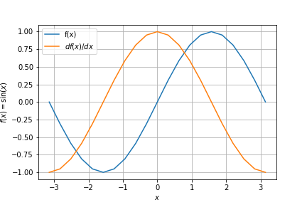

# Rustograd

An experimental implementation of autograd in Rust

## Overview

Neural networks heavily rely on differentiation.
In a previous project of mine [DeepRender](https://github.com/msakuta/DeepRender), I implemented derivatives of each activation function by hand, but practical deep learning libraries usually comes with automatic differentiation (autograd).

Inspired by [this video](https://youtu.be/VMj-3S1tku0), it seems not too difficult to build such a library myself, so I gave it a try.

## Usage

First, build an expression with usual Rust arithmetics, but wrap the value in `Term::Value`.
Note that you need to take a reference (like `&a`) to apply arithmetics due to how operator overloading works in Rust.

```rust
    let a = Term::new("a", 123.);
    let b = Term::new("b", 321.);
    let c = Term::new("c", 42.);
    let ab = &a + &b;
    let abc = &ab * &c;
```

Next, you can derive the expression with any variable and get the coefficient.

```rust
    let abc_a = abc.derive(&a);
    println!("d((a + b) * c) / da = {}", abc_a); // 42
    let abc_b = abc.derive(&b);
    println!("d((a + b) * c) / db = {}", abc_b); // 42
    let abc_c = abc.derive(&c);
    println!("d((a + b) * c) / dc = {}", abc_c); // 444
```

Lastly, you can call `backprop` to update all terms at once, much more efficiently than calling `derive` for every one of them.

```rust
    abc.backprop();
```

It's a little easier to see it with Graphviz than the console, so output the `.dot` file like this:

```rust
    abcd.dot(&mut std::io::stdout()).unwrap();
```

Copy and paste the output into [Graphviz online](https://dreampuf.github.io/GraphvizOnline).


## Rc and reference versions

Rustograd terms come in two flavors.
One is reference-based terms, `Term<'a>`.
The other is Rc-based terms, `RcTerm`.

The reference-based term is more efficient when you run the calculation only once, since it doesn't have reference counting overhead.
However, there is a very strict restriction that every intermediate term is required to live as long as the expression is evaluated.
It means you can't even compile a function below, because the temporary variable `b` will be dropped when the function returns.

```rust
fn model<'a>() -> (Term<'a>, Term<'a>) {
    let a = Term::new("a", 1.);
    let b = Term::new("b", 2.);
    let ab = &a * &b;
    (a, ab)
}
```

`RcTerm` works even in this case since it is not bounded by any lifetime:

```rust
fn model() -> (RcTerm, RcTerm) {
    let a = RcTerm::new("a", 1.);
    let b = RcTerm::new("b", 2.);
    let ab = &a * &b;
    (a, ab)
}
```

It is especially handy when you want to put the expression model into a struct, because it would require self-referential struct with `Term<'a>`.
Current Rust has no way of constructing a self-referential struct explicitly.
Also you don't have to write these lifetime annotations.

Generally `RcTerm` is more convenient to use, but it adds some cost in reference counting.

## Adding a unary function

You can add a custom function in the middle of expression tree.

For example, you can get a term `sin(a)` from `a` by calling `apply` method.
You need to supply with the function and its derivative as function pointers.

```rust
    let a = Term::new("a", a_val);
    let sin_a = a.apply("sin", f64::sin, f64::cos);
```

You can get the plot of the derivative of the expression by evaluating with various values for the input variable.

```rust
    for i in -10..=10 {
        let x = i as f64 / 10. * std::f64::consts::PI;
        a.set(x).unwrap();
        sin_a.eval();
        println!("[{x}, {}, {}],", sin_a.eval(), sin_a.derive(&a));
    }
```



Of course, this is so stupidly simple example, but it can work with more complex expression.

```rust
    let a = Term::new("a", a_val);
    let sin_a = a.apply("sin", f64::sin, f64::cos);
    let ten = Term::new("5", 5.);
    let b = &a * &ten;
    let c = Term::new("c", 0.2);
    let sin_b = b.apply("sin", f64::sin, f64::cos);
    let c_sin_b = &c * &sin_b;
    let all = &sin_a + &c_sin_b;
```


See [mixed_sine.rs](examples/mixed_sine.rs) for the full example.


## A procedural macro to build expression

It is pretty tedious to write a complex expression like the one above.
There is a feature flag `macro` which can simplify writing it.

For example, the example above can be written like this:

```rust
use rustograd_macro::rustograd;

rustograd! {{
    let a = 0.;
    let all = sin(a) + 0.2 * sin(a * 5.);
}}
```

You need to enable the feature flag like below:

```
cargo r --features macro --example mixed_sine_macro
```

For a reason in `syn` crate's design, the `rustograd!` macro needs to wrap the contents in double braces `{{}}`.

You need to define functions derivatives by postfixing `_derive` to automatically bind derivatives of the function.
For example, in the example above, we need `sin` function.
Its derivative shall have a name `sin_derive`, like below.

```rust
fn sin(x: f64) -> f64 { x.sin() }
fn sin_derive(x: f64) -> f64 { x.cos() }
```
