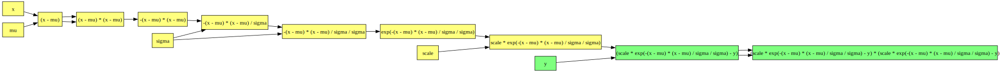

# Rustograd

An experimental implementation of reverse-mode, define-and-run autograd in Rust

## Overview

Neural networks heavily rely on differentiation.
In a previous project of mine [DeepRender](https://github.com/msakuta/DeepRender), I implemented derivatives of each activation function by hand, but practical deep learning libraries usually comes with automatic differentiation (autograd).

Inspired by [Andrej Karpathy's video](https://youtu.be/VMj-3S1tku0), it seems not too difficult to build such a library myself, so I gave it a try.

**NOTE**: This project is experimental research project. If you are looking for a serious autograd library, check out [rust-autograd](https://github.com/raskr/rust-autograd).

## Usage

First, build an expression with usual Rust arithmetics, but wrap the value in `Term::new`.
Note that you need to take a reference (like `&a`) to apply arithmetics due to how operator overloading works in Rust.

```rust
    let a = Term::new("a", 123.);
    let b = Term::new("b", 321.);
    let c = Term::new("c", 42.);
    let ab = &a + &b;
    let abc = &ab * &c;
```

Next, you can derive the expression with any variable and get the coefficient.

```rust
    let abc_a = abc.derive(&a);
    println!("d((a + b) * c) / da = {}", abc_a); // 42
    let abc_b = abc.derive(&b);
    println!("d((a + b) * c) / db = {}", abc_b); // 42
    let abc_c = abc.derive(&c);
    println!("d((a + b) * c) / dc = {}", abc_c); // 444
```

Lastly, you can call `backprop` to update all terms at once, much more efficiently than calling `derive` for every one of them.

```rust
    abc.backprop();
```

It's a little easier to see it with Graphviz than the console, so output the `.dot` file like this:

```rust
    abcd.dot(&mut std::io::stdout()).unwrap();
```

Copy and paste the output into [Graphviz online](https://dreampuf.github.io/GraphvizOnline).


Animated sequence of forward and backpropagation:


## Rc, reference and tape versions

Rustograd terms come in three flavors.

* reference-based terms, `Term<'a>`.
* Rc-based terms, `RcTerm`.
* Tape memory arena based terms, `TapeTerm`.

The reference-based term is more efficient when you run the calculation only once, since it doesn't have reference counting overhead.
However, there is a very strict restriction that every intermediate term is required to live as long as the expression is evaluated.
It means you can't even compile a function below, because the temporary variable `b` will be dropped when the function returns.

```rust
fn model<'a>() -> (Term<'a>, Term<'a>) {
    let a = Term::new("a", 1.);
    let b = Term::new("b", 2.);
    let ab = &a * &b;
    (a, ab)
}
```

`RcTerm` works even in this case since it is not bounded by any lifetime:

```rust
fn model() -> (RcTerm, RcTerm) {
    let a = RcTerm::new("a", 1.);
    let b = RcTerm::new("b", 2.);
    let ab = &a * &b;
    (a, ab)
}
```

It is especially handy when you want to put the expression model into a struct, because it would require self-referential struct with `Term<'a>`.
Current Rust has no way of constructing a self-referential struct explicitly.
Also you don't have to write these lifetime annotations.

`TapeTerm` uses a shared memory arena called the `Tape`.
It removes the need of explicit management of the lifetimes and has ergonomic arithmetic operation (since it is a copy type), but you need to pass around the arena object.
See [this tutorial](https://rufflewind.com/2016-12-30/reverse-mode-automatic-differentiation) for more details.

```rust
fn model(tape: &Tape) -> (TapeTerm, TapeTerm) {
    let a = tape.term("a", 1.);
    let b = tape.term("b", 2.);
    let ab = a * b;
    (a, ab)
}
```

Generally `RcTerm` is the most convenient to use, but it adds some cost in reference counting.
`TapeTerm` is fairly convenient and if you don't mind carrying around a reference to `tape` object everywhere, probably it is the most efficient and ergonomic way.
The tape is expected to be more efficient because the nodes are allocated in a contiguous memory and they will keep being accessed throughout training.

## Adding a unary function

You can add a custom function in the middle of expression tree.

For example, you can get a term `sin(a)` from `a` by calling `apply` method.
You need to supply with the function and its derivative as function pointers.

```rust
    let a = Term::new("a", a_val);
    let sin_a = a.apply("sin", f64::sin, f64::cos);
```

You can get the plot of the derivative of the expression by evaluating with various values for the input variable.

```rust
    for i in -10..=10 {
        let x = i as f64 / 10. * std::f64::consts::PI;
        a.set(x).unwrap();
        sin_a.eval();
        println!("[{x}, {}, {}],", sin_a.eval(), sin_a.derive(&a));
    }
```


Of course, this is so stupidly simple example, but it can work with more complex expression.

```rust
    let a = Term::new("a", a_val);
    let sin_a = a.apply("sin", f64::sin, f64::cos);
    let ten = Term::new("5", 5.);
    let b = &a * &ten;
    let c = Term::new("c", 0.2);
    let sin_b = b.apply("sin", f64::sin, f64::cos);
    let c_sin_b = &c * &sin_b;
    let all = &sin_a + &c_sin_b;
```


See [mixed_sine.rs](examples/mixed_sine.rs) for the full example.


## A procedural macro to build expression

It is pretty tedious to write a complex expression like the one above.
There is a feature flag `macro` which can simplify writing it.

For example, the example above can be written like this:

```rust
use rustograd_macro::rustograd;

rustograd! {{
    let a = 0.;
    let all = sin(a) + 0.2 * sin(a * 5.);
}}
```

You need to enable the feature flag like below:

```
cargo r --features macro --example mixed_sine_macro
```

For a reason in `syn` crate's design, the `rustograd!` macro needs to wrap the contents in double braces `{{}}`.

You need to define functions derivatives by postfixing `_derive` to automatically bind derivatives of the function.
For example, in the example above, we need `sin` function.
Its derivative shall have a name `sin_derive`, like below.

```rust
fn sin(x: f64) -> f64 { x.sin() }
fn sin_derive(x: f64) -> f64 { x.cos() }
```

## Example applications

In the following examples, I use `TapeTerm` because it is expected to be the most efficient one in complex expressions.

### Curve fitting

[examples/tape_curve_fit.rs](examples/tape_curve_fit.rs)

Let's say, we have a set of measured data that supposed to contain some Gaussian distribution.
We don't know the position and spread (standard deviation) of the Gaussian.
We can use least squares fitting to determine the parameters $\mu, \sigma, s$ in the expression below.

$$
f(x; \mu, \sigma, s) = s \exp \left(-\frac{(x - \mu)^2}{\sigma^2} \right)
$$

To apply least squares fitting, we define the loss function like below (denoting $x_i, y_i$ as the $i$th sample).

$$
L = \sum_i (f(x_i) - y_i)^2
$$

We could calculate the gradient by taking partial derivates of the loss function with respect to each parameter and descend by some descend rate $\alpha$, but it is very tedious to calculate by hand (I mean, it's not too bad with this level, but if you try to expand this method, it quickly becomes unmanageable).

$$
\begin{align*}
\mu &\leftarrow \mu - \alpha \frac{\partial L}{\partial \mu} \\
\sigma &\leftarrow \sigma - \alpha \frac{\partial L}{\partial \sigma} \\
s &\leftarrow s - \alpha \frac{\partial L}{\partial s}
\end{align*}
$$

Here autograd comes to rescue! With autograd, all you need is to build the expression like below and call `loss.backprop()`.

```rust
    let x = tape.term("x", 0.);
    let mu = tape.term("mu", 0.);
    let sigma = tape.term("sigma", 1.);
    let scale = tape.term("scale", 1.);
    let x_mu = x - mu;
    let gaussian = scale * (-(x_mu * x_mu) / sigma / sigma).apply("exp", f64::exp, f64::exp);
    let sample_y = tape.term("y", 0.);
    let diff = gaussian - sample_y;
    let loss = diff * diff;
```

Below is an animation of gradient descent in action, using gradient calculated by autograd.


The computational graph is like below.



It may not seem so impressive since you can estimate the parameters directly from sample mean and standard deviation like below if the distribution is a Gaussian, but it gets more interesting from the next section.

$$
\begin{align*}
\mu &= \frac{1}{N}\sum_i x \\
\sigma &= \sqrt{\frac{1}{N - 1}\sum_i (x - \mu)^2}
\end{align*}
$$


### Peak separation

[examples/peak_separation.rs](examples/peak_separation.rs)

Another important application often comes up with measurement is peak separation.
It is similar to curve fitting, but the main goal is to identify each parameter from a mixed signal of Gaussian distributions.

$$
f(x; \mathbf{\mu}, \mathbf{\sigma}, \mathbf{s}) = \sum_k s_k \exp \left(-\frac{(x - \mu_k)^2}{\sigma_k^2} \right)
$$

The model is quite similar to the previous example, but there are 2 Gaussian distributions, which shares the structure, so I used a lambda to factor it.

```rust
    let x = tape.term("x", 0.);

    let gaussian = |i: i32| {
        let mu = tape.term(format!("mu{i}"), 0.);
        let sigma = tape.term(format!("sigma{i}"), 1.);
        let scale = tape.term(format!("scale{i}"), 1.);
        let x_mu = x - mu;
        let g = scale * (-(x_mu * x_mu) / sigma / sigma).apply("exp", f64::exp, f64::exp);
        (mu, sigma, scale, g)
    };

    let (mu0, sigma0, scale0, g0) = gaussian(0);
    let (mu1, sigma1, scale1, g1) = gaussian(1);
    let y = g0 + g1;

    let sample_y = tape.term("y", 0.);
    let diff = y - sample_y;
    let loss = diff * diff;
```


At this point, the computation graph becomes so complicated that I won't even bother calculating by hand. However, autograd keeps information of factored values and do not repeat redundant calculation.


There is one notable thing about this graph.
The variable $x$ is shared among 2 Gaussians, so it appears as a node with 2 children.
This kind of structure in the computational graph is automatically captured with autograd.

Also there are 2 arrows from `(x - mu0)` to `(x - mu0) * (x - mu0)` because we repeat the same expression to calculate square.


